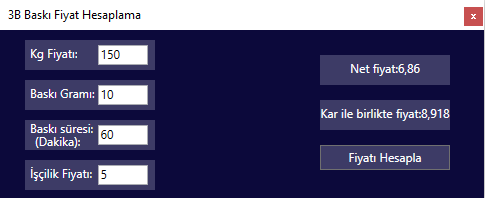

# 3B Baskı Fiyat Hesaplama Uygulaması

**Bu benim yağtığım ilk wpf uygulamasıdır.**

Bu uygulama basit olarak Kg Fiyatı , Baskı Gramı , İşçilik Fiyatı gibi verileri kullanıcıdan alıp. Belirli işlemlerden geçirip bize net fiyat ve satış için üzerine kar koyulmuş fiyatı verir.

  

## Kurulum

Klasörü indirdikten sonra **3BBaskiFiyatHesaplama.exe** dosyasına çift tıklıyoruz. 

## Nasıl kullanılır?

Uygulamamızı açtıktan sonra filamentin kilogram fiyatını , baskının gramını ve işçilik fiyatını yazıyoruz. Unutmayın **bütün boşlukları doldurun**. Daha sonra fiyat hesapla düğmesine basıyoruz ve net fiyat(Parçanın bize ne kadara mal olduğu.), Kar ile birlikte fiyat(Satış için gerekli olan fiyat)

## Not: Source dosyalarını Source File dosyasında bulabilirsiniz

## İletişim

Twitter - [Hüseyin Avni Sarıkaya](https://twitter.com/Zorganight)

Mail - hasarikaya00@gmail.com

Site - [Makerstreets](https://makerstreets.com)
